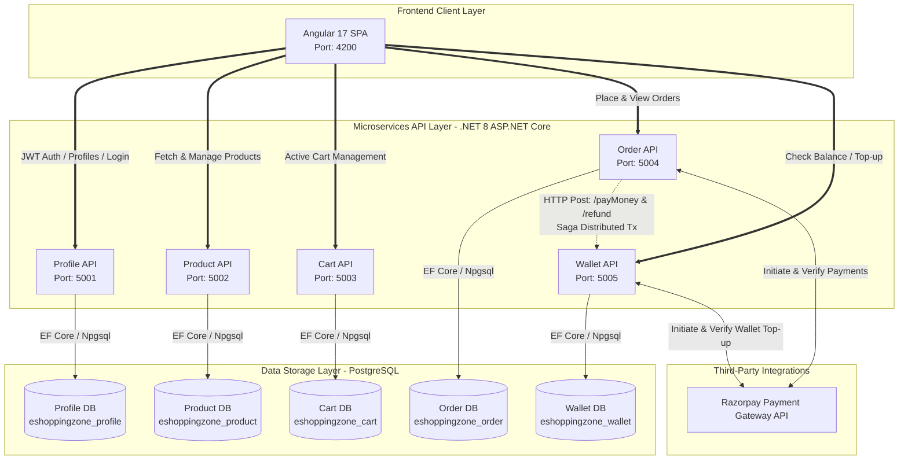
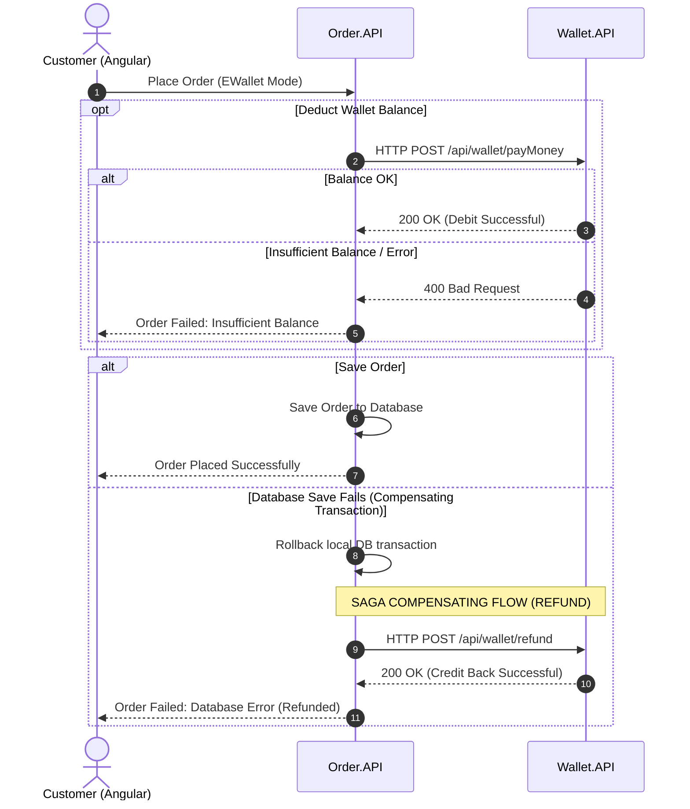

# High-Level Architecture Diagram: EShoppingZone

This document presents the **High-Level Architecture** of the **EShoppingZone** application, a full-stack, enterprise-grade e-commerce application built using a modern decoupled architecture. It highlights the overall system structure, microservices organization, communication paths, and external payment integration.

---

## 1. Architectural Overview

EShoppingZone uses a **Database-per-Service Microservices Architecture** combined with an **Angular Single Page Application (SPA)** client. This decoupling ensures high scalability, independent deployments, and strong isolation of concerns across business domains.

---

## 2. System Components

### A. Frontend Client (`eshoppingzone-frontend`)
*   **Technology**: Angular 17 SPA, TypeScript, HTML5, CSS3, RxJS.
*   **Responsibilities**: Exposes the user interface to three distinct roles: **Customer**, **Merchant**, and **Admin**.
*   **Routing**: Secure router setup utilizing Angular guards (`authGuard`, `roleGuard`) to strictly enforce role-based access.

### B. Microservices API Layer (`EShoppingZone`)
Built with **.NET 8** and organized as independent, lightweight RESTful web services:
1.  **Profile API (Port 5001)**: Manages authentication, JWT token generation, user profiles (Customers, Merchants, Admins), and shipping addresses.
2.  **Product API (Port 5002)**: Handles product catalogs, inventory list additions, updates, deletions, and filtering for merchants and buyers.
3.  **Cart API (Port 5003)**: Manages customer shopping carts and items in memory/persistence before purchase.
4.  **Order API (Port 5004)**: Manages the lifecycle of orders, Razorpay integration, online payments, and coordinates transactions.
5.  **Wallet API (Port 5005)**: Simulates a digital e-wallet enabling customers to load funds (via Razorpay) and purchase goods directly using their balance.

### C. Data Storage Layer
*   **Technology**: PostgreSQL.
*   **Isolation**: Adheres to the *Database-per-service* pattern. No service can directly query another service's database. This maintains clean bounds and prevents tight database-level coupling.

### D. Third-Party Payments (Razorpay)
*   **Integration**: Integrated directly at the backend service layer in both `Order.API` and `Wallet.API`.
*   **Security**: Signature validation (`Utils.verifyPaymentSignature`) is handled server-side to guarantee payment authenticity before dispatching/crediting orders or wallets.

---

## 3. Core Architectural Patterns

### A. Distributed Transactions (Saga Pattern)
When a customer pays for an order using their **E-Wallet**, the transaction spans two independent microservices: `Order.API` and `Wallet.API`. EShoppingZone uses a **Saga pattern with compensating transactions** to guarantee eventual consistency:

### B. Security & Token-Based Authentication
*   **Mechanism**: JWT Bearer Tokens.
*   **Authentication Flow**: The customer authenticates against `Profile.API` and receives a JWT signed with a secret key containing claims (User ID, Full Name, Role).
*   **Authorization Flow**: The frontend attaches the token in the `Authorization` HTTP header for subsequent microservice requests. Each microservice decodes and validates the token locally using the shared validation configuration.
