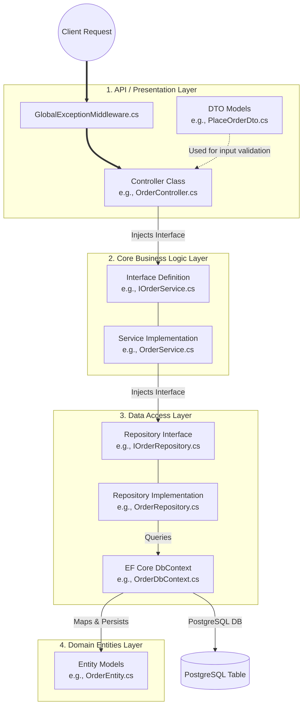
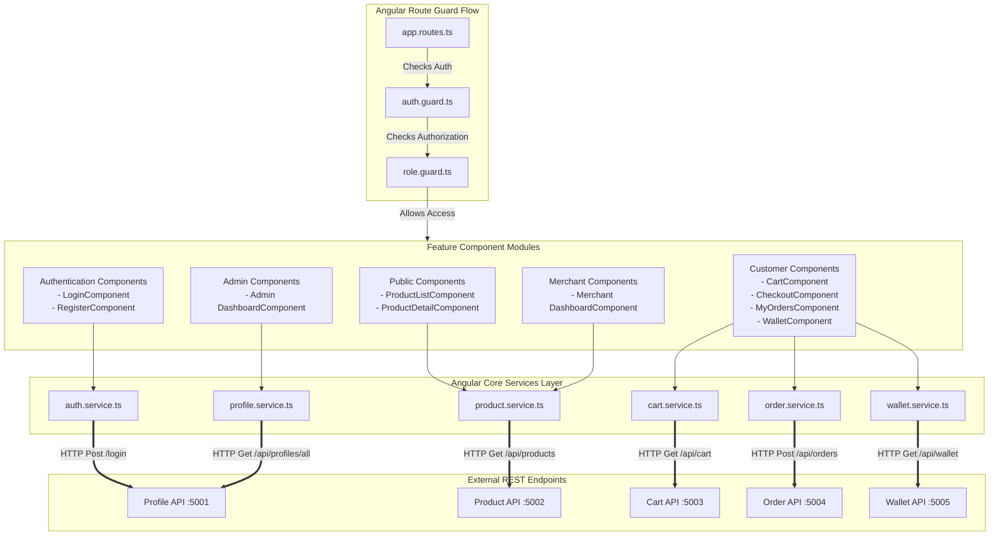
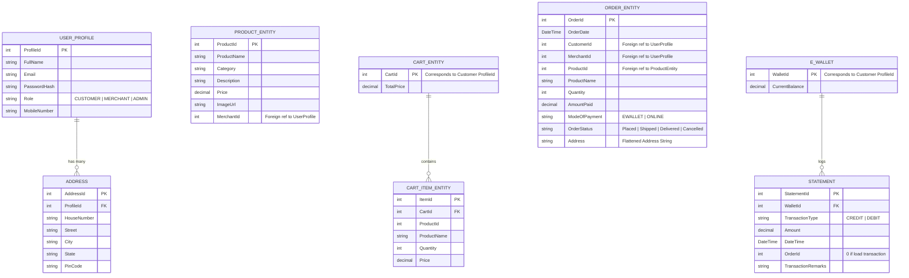

# Low-Level Architecture & Implementation Diagram: EShoppingZone

This document outlines the **Low-Level Design (LLD)** of both the backend .NET 8 microservices and the frontend Angular 17 application. It explains the class structures, database entity models, dependency injections, and data access layers.

---

## 1. Backend Microservices Internals (N-Tier Clean Architecture)

Each of the five microservices (`Profile`, `Product`, `Cart`, `Order`, `Wallet`) is structured using an N-Tier architecture pattern that enforces a clean separation of concerns.



### Backend Components Deep-Dive

#### A. Controller Layer (Presentation)
*   **Routing**: Defined using route attributes (e.g., `[Route("api/orders")]`).
*   **Model Validation**: Enforces strict input rules. Handled automatically in `Program.cs` by overriding `InvalidModelStateResponseFactory` to return uniform validation error formats.
*   **Authentication & Authorization**: Controlled via `[Authorize]` and `[Authorize(Roles = "CUSTOMER")]` attributes, using the claims extracted from JWTs.

#### B. Business Logic Service Layer
*   **Abstraction**: Business logic is separated into service implementations behind interfaces (e.g. `IOrderService` implemented by `OrderService`).
*   **Responsibility**:
    *   Saga transaction orchestrations (calling the `WalletAPI` from `OrderService`).
    *   Third-party SDK interactions (e.g., calling Razorpay APIs to generate order IDs or verify signatures).
    *   Calculating order subtotals and wallet balance adjustments.

#### C. Repository & Database Context Layer
*   **EF Core**: Database tables are configured and queried using Entity Framework Core.
*   **Npgsql**: PostgreSQL provider for Entity Framework Core.
*   **Auto-Migration**: Upon application start, the program executes migrations automatically:
    ```csharp
    using (var scope = app.Services.CreateScope())
    {
        var db = scope.ServiceProvider.GetRequiredService<DbContext>();
        db.Database.Migrate();
    }
    ```

---

## 2. Frontend Application Internals (Angular)

The Angular client follows a modular, feature-oriented structure with distinct pages, shared UI elements, and a core services layer managing HTTP requests.



---

## 3. Database Entity Relationship (Logical Design)

Each microservice isolates its domain entities. The following diagram models the logical associations and records across these service boundaries.


